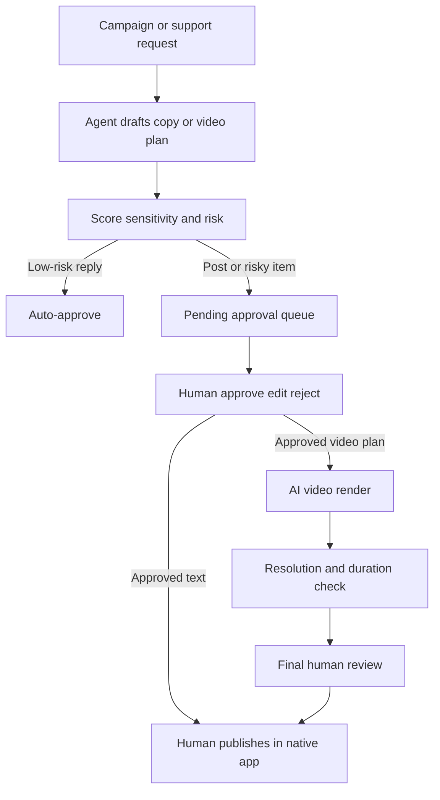

# Trustless Commerce Go-To-Market and Operations Plan

## 1. Objective

Use `social-bro` to run a controlled, human-reviewed marketing and support system for Trustless Commerce so the product can:

- explain what the platform does in plain English,
- acquire merchants and technical users through content and distribution,
- maintain a consistent short-form media presence,
- respond to support requests quickly without exposing the brand to avoidable risk.

Current public homepage message:

> "Generate a pay link with the fields you already know from your order system."

That positioning is simple, but it needs a broader content system around:

- merchant use cases,
- trustless payout flow,
- deterministic invoice addresses,
- supported chains/tokens,
- integration path,
- security posture,
- operational FAQs,
- launch and credibility content.

## 2. Default operating scope

### Marketing channels

1. X/Twitter
   - short launch posts
   - educational threads
   - founder-style replies
   - ecosystem engagement replies

2. Instagram
   - vertical clips
   - product concept explainers
   - caption sets
   - carousel copy ideas

3. YouTube
   - Shorts scripts
   - titles
   - descriptions
   - chapter packs
   - thumbnail text

4. Blog and SEO
   - product explainers
   - comparisons
   - implementation guides
   - merchant onboarding pages
   - glossary pages

5. Telegram support
   - first-line support
   - escalation routing
   - approval desk for content operations

### Support scope

TG Guy handles:

- FAQ answers
- content approvals
- triage of billing/refund/legal complaints
- escalation collection

TG Guy does not:

- promise refunds
- make legal statements
- invent roadmap commitments
- claim unsupported integrations

## 3. Recommended message architecture

### Primary positioning

Trustless Commerce lets teams generate crypto payment links and invoice flows using order data they already have, while keeping payout logic deterministic and auditable.

### Key message pillars

1. Simplicity
   - "Generate a pay link from data you already have."

2. Trust-minimized payout flow
   - deterministic invoice/payment addresses
   - payout logic anchored to contract execution

3. Merchant operations
   - usable by real checkout/order systems
   - easier handoff between app, finance, and customer support

4. Technical credibility
   - CREATE2 / deterministic addressing
   - invoice execution validation
   - explicit sweep flow

5. Adoption path
   - start with pay links
   - move into integration
   - expand to more complex commerce flows

## 4. Agent responsibilities

### Twitter Guy

- draft X posts, replies, and thread concepts
- prepare engagement replies for web3 / payments / merchant conversations
- never post directly

### Instagram Guy

- produce AI video plans
- draft scripts, hooks, and captions
- render short clips after approval
- final reels remain human-published

### YouTube Guy

- create Shorts concepts and scripts
- create long-form packaging assets
- produce titles, descriptions, chapters, and thumbnail text

### Blog Guy

- create SEO briefs
- write product pages and articles
- maintain glossary and comparison content

### TG Guy

- run approvals
- handle support
- store feedback
- enforce escalation rules

## 5. Content workflow

## 6. Default deliverables

### Weekly deliverables

- 3 to 5 X posts
- 10 to 20 X replies
- 2 Instagram reels or short clips
- 2 YouTube Shorts scripts/packages
- 1 SEO article or landing page draft
- support coverage through Telegram triage

### Monthly deliverables

- 4 to 8 SEO/blog assets
- 8 to 12 short-form video concepts
- 1 content performance review
- 1 support and escalation review
- 1 message refresh based on objections and questions

## 7. SEO plan

### Initial keyword cluster themes

1. Crypto payment links
2. On-chain invoices
3. Deterministic payment addresses
4. Merchant crypto checkout
5. Stablecoin merchant payments
6. Embedded crypto commerce
7. Trustless payout infrastructure

### First SEO asset set

- "What is a crypto payment link for merchants?"
- "Deterministic invoice addresses explained"
- "How trust-minimized payouts work"
- "Merchant stablecoin checkout: architecture choices"
- "Crypto invoices vs manual wallet collection"
- glossary:
  - deterministic address
  - sweep
  - invoice forwarder
  - merchant payout

## 8. Support policy defaults

### Auto-handle

- simple FAQ
- password/reset style issues
- "how does approval work" questions
- content status requests

### Escalate to human

- refunds
- chargebacks
- legal threats
- fraud claims
- incorrect payment destination concerns
- security incidents
- chain/token support disputes

## 9. KPIs

### Marketing KPIs

- publishing cadence adherence
- impressions / reach
- profile clicks
- site visits from social
- CTA clicks
- newsletter/demo/contact intent
- SEO pages published
- organic impressions and clicks

### Support KPIs

- first-response time
- escalation rate
- auto-resolved rate
- unresolved queue age
- repeat question frequency

## 10. Deployment and operations requirements

### Required runtime inputs

- `.env` for secrets
  - Telegram bot token
  - Replicate API token
  - model-provider keys if used
- `config.yaml` for non-secret rules
- docker compose deployment stack

### Recommended production setup

- VPS with Docker
- nginx on 80/443
- watchtower for controlled auto-updates
- mounted data directory for queue, ops, and generated clips
- TLS certs mounted from host

## 11. What I still need from you

1. Final brand tone for public content
2. Claims the brand is allowed to make
3. Refund/billing/support policy
4. SLA for support replies and content approvals
5. Commercial target:
   - merchants
   - agencies
   - developers
   - platforms
6. Priority chains/tokens and integrations to mention publicly
